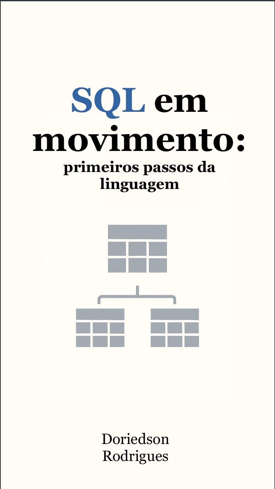

-------

# Projeto EBOOK Gerado por I.A.s

 > ℹ️ **NOTE:** Este é o repositório desenvolvido durante o curso no qual fui instrutor técnico na plataforma da [DIO](https://dio.me)

Projeto com o objetivo de gerar um ebook digital com as facilidades das ferramentas de IA. todos os prompts
seguem abaixo.

<a href="https://github.com/doriedson-1/prompts-recipe-to-create-a-ebook/blob/main/output/Ebook%20-%20SQL.pdf" title="View PDF now">
📕Clique aqui para ler</a>

## 💻 Tecnologias utilizadas no projeto

- [Copilot](https://copilot.microsoft.com/)
- [Libre Impress](https://pt-br.libreoffice.org/)

## 🧠 Prompts

Copilot：

| Ação | Prompt |
|---|---|
| Título | Crie um título de um pequeno ebook que possui como tema o SQL. O título deve expressar a ideia de um livro que  explica os primeiros passos para entender essa linguagem. Foque em títulos inéditos, autorais. |
| Conteúdo | Faça uma narrativa que exemplifique a vida de bibliotecários e arquivistas antes da existência de bancos de dados e sql |

## ✨ Features

- Conteúdo gerado via Microsoft Copilot

## 📚 Materiais

- Imagens utilizadas em `assets`
- ebook gerado durante as aulas em `output`

## 🛠️ Instruções de execução

Utilize os prompts acima nas ferramentas sugeridas para gerar o material base e utilize uma ferramenta de edição de documentos como power point, libreoffice , indesign para diagramação.

---

⌨️ com 💜 por [Doriedson Rodrigues](https://github.com/doriedson-1)